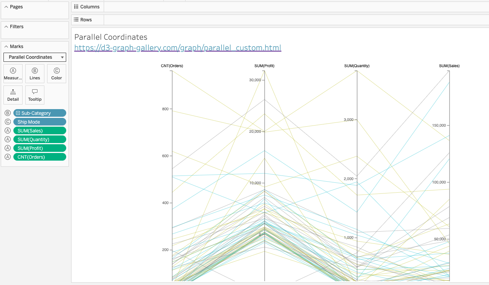
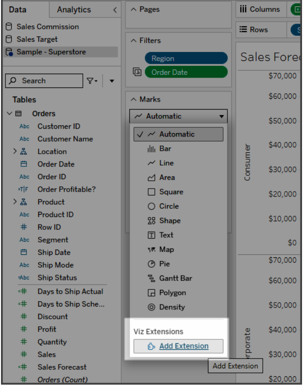
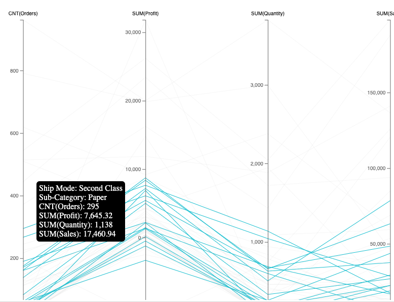

# Tableau Viz Extension: Parallel Coordinates Chart
This project allows you to create parallel coordinate charts easily in Tableau, using the new [Viz Extensions API]().  

#   How to use this Viz Extension
##  Step 1: Add the Chart Type
You can get started using this new chart type, by first download the [.trex](parallelCoordinates.trex) file from this repository.  

From the Tableau authoring UI, use the Marks card's dropdown menu to find the **Add Extension** button.

Select **Access Local Extensions** and upload the .trex file.

##  Step 2: Configure the chart
Parallel Coordinate charts show a line for every row of data, and that line spans multiple axis (one per measure).  To make an effective chart, you should include 1 dimension and at least 2 measures.  You can actually add up to 10 measures, but the sweet spot is typically 3~8 (otherwise the chart starts to get crowded).  You can also specify a dimension to use for color.

* Drag 1 dimension to Lines
* Drag 2+ measures to Measures
* [Optional] Drag 1 dimension to Color

The chart should render automatically, and adjust to fit the entire sheet.  If you hover over a line, you will see a tooltip popup with the mark's values.  If you specified a dimension for color, you will also notice that hovering over a line will highlight all other lines of the same color
